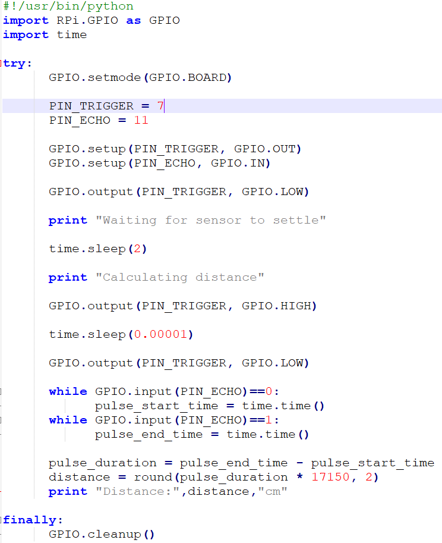
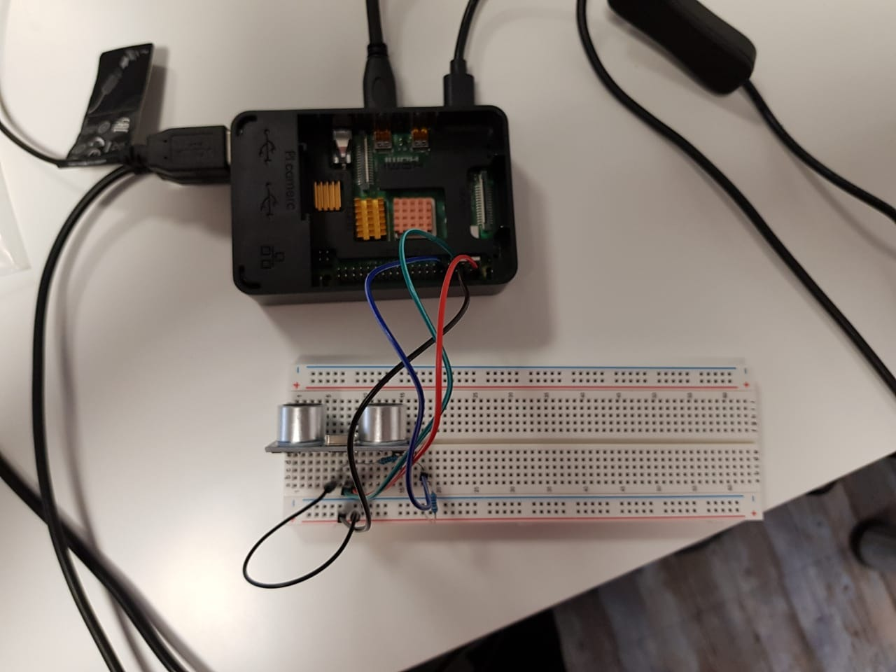
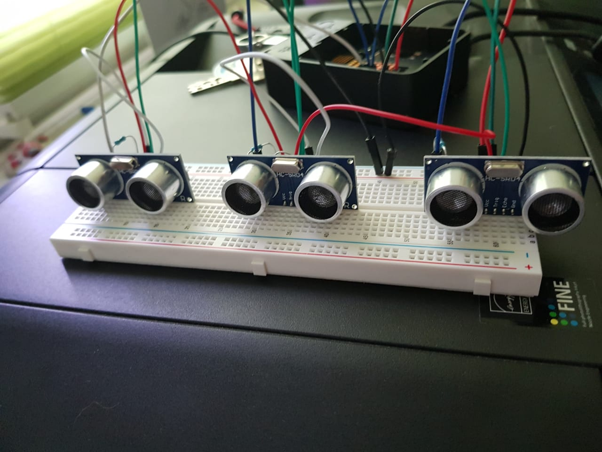
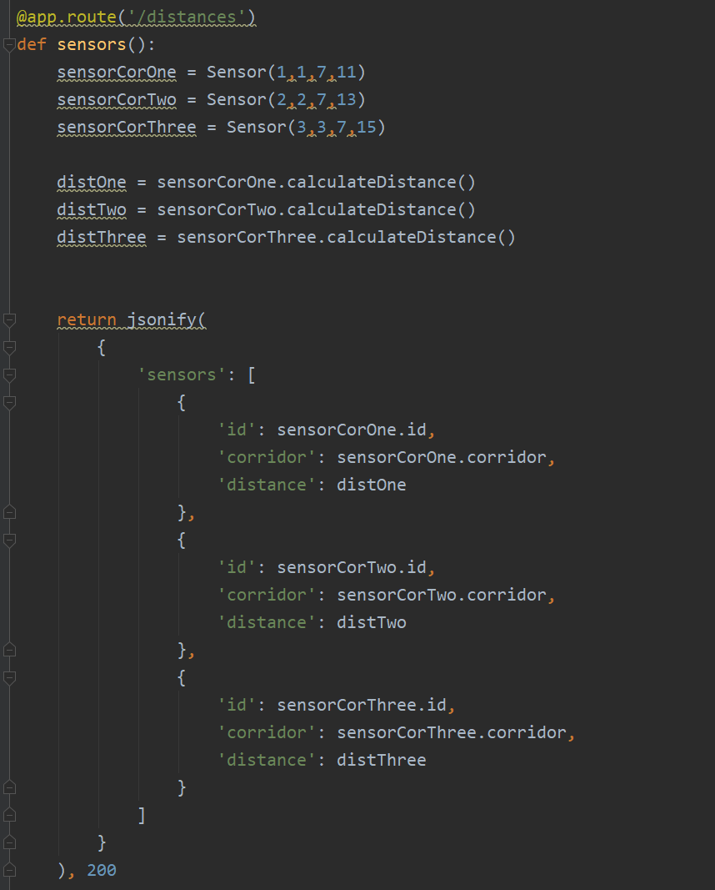
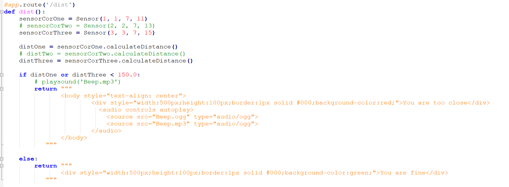
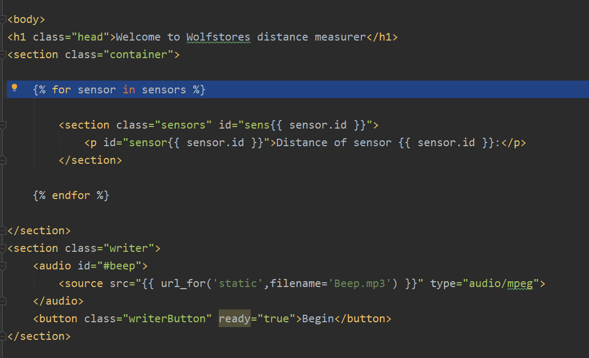
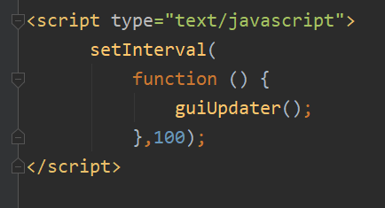
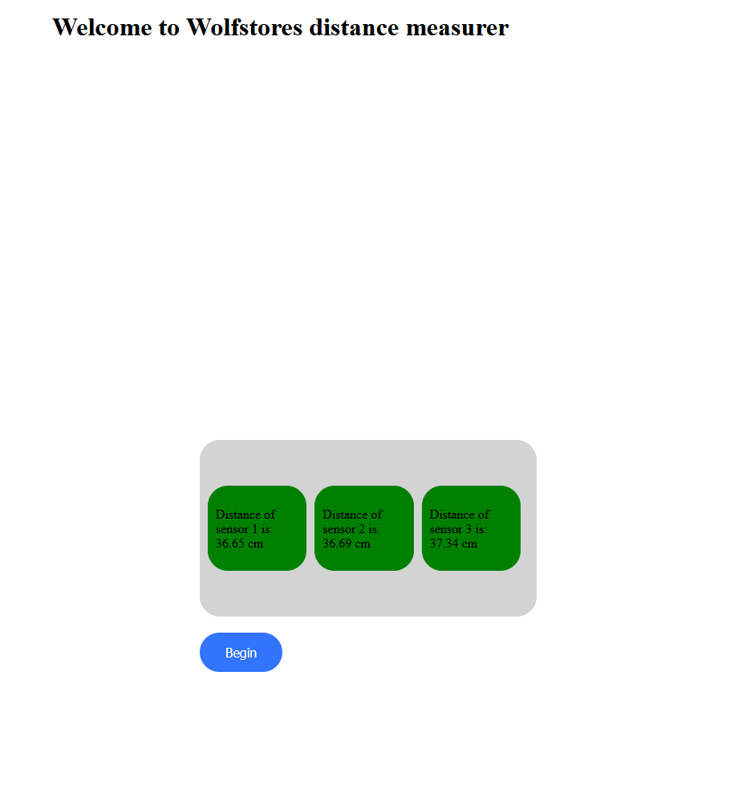

---
title: "Wolffstore - Digitalization of forklift trucks"
author: [Fotios Alatas, Thomas Reiners, Marcel Reiners, René Wolff, Stefan Sobek]
date: "2020-04-15"
subject: "Haskell"
keywords: [Fontys, Wolffstore, Digipro]
lang: "en"
titlepage: "true"
logo: "media/wolffstoregmbh.png"
titlepage-rule-color: "400070"
...

# Abstract
 
Ziel des Projektes ist es einen Prototypen zu erstellen, welcher über Abstandssensorik verfügt. Die Projektidee ergibt sich aus der Gegebenheit, dass die Mitarbeiter innerhalb der Wolffstore GmbH diverse Gabelstapler ohne Sensorik nutzen. Bei der Kommissionierung innerhalb der Hochregallager kommt es häufig vor, dass ein Mitarbeiter gegen das Hochregallager fährt und dadurch vorallem die Lagerregale sowie die sich darin befindende Waren beschädigt.   

The main objective of the project is to create a prototype equipped with sensors for distance measuring. The idea was born due to the issue in the storage hall of Wolffstore GmbH, that forklifts pretty often hit the storage racks. The root cause of that is mainly that there is barely space between the racks, but also that drivers are often too fast. 
The project outcome should be a demonstration prototype to show that the system can prevent the forklift from collisions with the storage racks or the goods in the racks. It should be found out which sensors could be used to effectively notify the driver of a too close approach to the racks. 
Additionally a autonomous star-stop solution should be analysed. 
The prototype should be the basis decision for further projects and investments of Wolffstore GmbH in this area. 

The project objectives were achieved. Standing out is of course the successful creation and testing of a sensor array based on a [Raspberry Pi 4](https://www.raspberrypi.org/products/raspberry-pi-4-model-b/) platform, which is a fully working mini-computer equipped with ultrasonic-sensors. 

The results of the first tests on the prototype leads to the conclusion that the reaction times of the used ultrasonic-sensors are sufficient for the use case. 

Furthermore, should be mentioned that it was planned to mount the platform on the forklift und to test the system integrated in the storage hall and doing measures in the correct use case scenario. However, due to the corona-pandemic and the external access restrictions to the storage hall of Wolffstore GmbH the execution was not possible. 

Due to the results of this project a decision was already made to continue with additional projects and investments in this direction. 

The objectives of the future projects will be to develop additional components, add more and further sensors (e.g. RfID, Cameras with AI asf.), doing further measurements regarding reaction time of the sensors, doing measurements and valdiation as well as calibration of the sensors, hard- and software regarding the the reaction times. Furthmore additional scenarios should be investigated and solved like **Securing entering of the space between storage racks** or **Securing the drive of the forklift between storage racks**. 
More sensors, e.g. side sensors or sensors mounted on the racks are necessary as well as the integration of the whole system (integrate sensors with hard- and software). Important is also the planning and development of a visual and audio warning system on the forklift as well as an automatic emergency stop on collision. 

# Zusammenfassung

Bereits seit über 15 Jahren begleitet die Wolffstore GmbH ihre Kunden rund um das Thema „Onlinehandel“ & „Fulfillment“ europaweit. In Kooperation mit dem medienpark.nettetal soll ein intelligenter Gabelstapler geschaffen werden, der Abstandsinformationen (Sensorik) innerhalb eines Hochregallagers an den Fahrer weitergibt. Zusätzlich wird an einer Lösung gearbeitet, die Informationen nicht auf einem konventionellen Display angezeigt, sondern auf einem HeadUpDiplay, welches auf dem Gabelstapler verbaut ist.

Ziel des Projektes ist es einen Prototypen zu erstellen, welcher über Abstandssensorik verfügt. Die Projektidee ergibt sich aus der Gegebenheit, dass die Mitarbeiter innerhalb der Wolffstore GmbH diverse Gabelstapler ohne Sensorik nutzen. Bei der Kommissionierung innerhalb der Hochregallager kommt es häufig vor, dass ein Mitarbeiter gegen das Hochregallager fährt und dadurch vorallem die Lagerregale sowie die sich darin befindende Waren beschädigt.   
Mittels der Machbarkeitsstudie soll ein Demonstrator geschaffen werden, der darlegt welche Sensorik eingesetzt werden kann, um einen Mitarbeiter ein Signal zu senden, wenn dieser zu nahe an das Hochregallager heranfährt. Eine autonome Start-/Stop Lösung soll gleichermaßen analysiert werden.
Der Demonstrator dient als Entscheidungsbasis für weitere Projekte und Investitionen der Wolffstore GmbH. 

Die Projektziele wurden erreicht. Herauszuheben ist die erfolgreiche Umsetzung einer Sensorik Plattform mittels eines [Raspberry Pi 4](https://www.raspberrypi.org/products/raspberry-pi-4-model-b/), einem vollwertiger Miniplatinen-Rechner im Zusammenspiel mit mehreren Ultraschallsensoren.

Die Reaktionszeiten sowie die entsprechenden zu messbaren Abstände sind für den Anwendungsfall passend. 

Anzumerken ist noch, dass die Planung vorsah die Plattform mit Sensoren auf einem Gabelstapler zu montieren und entsprechende Testszenarien und Messungen durchzuführen. Hierzu ist es auf Grund der Corona-Pandemie und entsprechenden Zugangsbeschränkungen Externer zum Lager nicht mehr gekommen. 

Anhand der Ergebnisse ist bereits von der Wolffstore GmbH ein Folgeprojekt geplant.

Dazu sind die Komponenten weiterzuentwickeln, weitere Sensoriken anzubinden (z.B. RfiD-Erkennung, Kameras samt AI usw.) sind entsprechende Messungen durchzuführen bezüglich Reaktionszeit der Sensorik, Messungen und Validierung sowie Kalibrierung der Sensorik, Hard- und Software, sowie die Erweiterung des Anwendungsscenarios von **Sicherung der Einfahrt eines Gabelstapler zwischen Regalen** zu weiteren wie **Sicherung der Durchfahrt eines Gabelstaplers zwischen Regalen**. Dies erfordert mehr Sensorik (zusätzliche seitliche Sensorik) die Anpassung des Integrationssystems auf dem Gabelstapler (Einbindung Sensorik in Hardware und Softwaresteuerung) und die Planung und Entwicklung von visuellen und akustischen Warnsystemen auf dem Gabelstapler sowie ferner einer Not-ausschaltung bei Kollision. 

# Introduction

## 2. General Information

In this section general information regarding the project are reported
regarding the equipment, project organisation etc.

2.1. Equipment
--------------

In order to execute the desired experiment, the team used the following
components in Phase 1 (weeks 1-3):

-   Raspberry Pi 4 Model B

-   Ultrasonic Sensors HC-SR04

-   Elegoo’s starter Kit for the following – Resistors, Sensors, Cables
    etc.

A more complete view regarding the used components for each phase is
given in the introduction of each experiment description. All of the
pre-mentioned, equipment was provided by the Wolfstore GmbH and was
given to the team for experimentation along with access to the premises
for testing and meetings.

2.2. Raspberry Pi 4 assembly
----------------------------

As it was mentioned already in the above section a core part of the
experiment’s equipment is the Raspberry Pi. Before the experiment
started the team needed to assembly the parts of the Pi and install the
Raspbian OS (Operating System).

The former was accomplished by following the step-by-step video
instructions in the following
[*PDUESP* youtube video](https://www.youtube.com/watch?v=TEuVU6id_mI) by .

Regarding the installation of the operating system this was achieved
with the help of the NOOBS installer which is the recommended way of
installing the Raspbian OS in the corresponding Pi according to the
[instructions](https://projects.raspberrypi.org/en/projects/raspberry-pi-setting-up)
which were found in the official website.

2.3. Project Organisation
-------------------------

The project is a collaboration between the senior management of
Wolffstore GmbH (Marcel Reiners and Thomas Reiners) as well as one of the employees René Wolff and Fontys Venlo University of Applied Sciences which was represented by Mr. Stefan Sobek who is the project manager and a student assisstant Fotios Alatas.

The project does not have a standardised daily workload. Nevertheless,
there is always a geo-meeting every Friday where the pre-mentioned
stakeholders are meeting in order to discuss the project’s development,
test results and future developments. In addition, the student assistant
is supposed to work at least between 8 and 10 hours per week.

In addition, the student was allowed to work in the premises of
Wolfstrore Gmbh every Friday after the geo-meeting had taken place.

## 3. Experimentation

In this chapter the different phases of the experiment are going to be
analysed and explained by the authors of the report. The experiment was
conducted in different phases in order to deliver the final proof of
concept.

During the first week the team became acquainted with each other and the
project was explained to the student and to the Wolfstore senior team in
order to “paint” a clear picture of what needs to be built thus starting
Phase 1 of the project.

3.1 Phase One
-------------

During this phase the student had to setup the equipment and conduct a
small initial research in order to understand the required technologies
due to the fact that he did not had previous experience with them.

The setting up of the equipment was explained in section 2.2 and will
not be repeated in the following chapters.

Having finished with the raspberry pi assemble and the operating system
installation the first experiment was set up. The experiment needed to
first test the connection between the raspberry pi and the ultrasonic
sensor and later develop a script which would calculate the distance
between the sensor and any object that would be placed in front.

The components which were used during this phase were:

-   Raspberry Pi 4

-   Breadboard

-   1k and 2k Ohm resistors

-   5 connection cables (4 male-female and 1 male-male)

-   1 ultrasonic distance sensor (HC-SR04)

-   Conventional monitor, mouse and keyboard

In the following Picture 1, the reader is presented with a graphical
representation of the connections between the above systems.

The next step was to achieve the above design and to write the necessary
Python script in order to test the functionality of the sensor.

As it was already mentioned the language which is used is ***Python***
and the IDE which was used was the ***Thonny Python IDE*** which was
built in the Rasbpian Operating System. In the following snippet of
code, the script is seeing along with comments which explain what each
of the lines of code does.

The principal which is followed in order to calculate the distance using
the sound speed is derived from the following formula:

> **S(speed)** = **d(distance)** / **t(time)**

The sensor sends pulses and receives them thus calculating the time
between these pulses. Moreover, using the speed of sound and the
calculated time the distance can be calculated and depicted for the user
to see it.

The distance capacity that the HC-SR04 can measure varies from 2cm to
450cm (4,5m) and its accuracy is estimated to be 2mm.

Simultaneously, the team included the realisation of Picture 1 and a
video which depicts the results of the aforementioned script.

The next step of the experiment is to attempt 3 concurrent measurements
of the distance and calculate its average in order to provide more
credible results. In addition, it was decided to build a GUI which will
interact with the user and depict the result in order to provide a
better user experience.

3.2 Phase Two
-------------

As it was already mentioned above the next would try to perform three
concurrent measurements and return the average in order to get a more
credible reading. Nevertheless, the team decided against this idea due
to the fact that through experimentation it was found out that the
differences in measurements are negligible.

In this step the team built the server and
client side of the application and performed tests with three ultrasonic
sensors instead of one (see Picture 4 and 5).

Expanding the python code from above the team developed the server side
part of the application which would be deployed in the pre-mentioned
Raspberry Pi. The application was developed using the Flask python
framework and was deployed in the Pi using the NGINX webserver.

A class Sensor was created with a constructor which would take as
parameters an id which would be used to identify each sensor, the
corridor in which each sensor would be placed and the trigger and echo
pin numbers in which are connected on the Raspberry Pi.

Then using the above method, the app would be able to retrieve the
distance and compile a JSON file which can be retrieved and parsed by
the client side of the application. An example of the pre-mentioned code
can be seen in the following snippet (see Picture 6).

On the other hand, the client side regarding this phase was developed
using Java due to the student’s experience with it. The Graphical User
Interface was developed using JavaFX and more specifically its
***.fxml*** variant through the use of the open-source GUI-Builder
software SceneBuilder.

The application when switched on, would use a Timer which would perform
a REST-GET &lt; 1s and read the measurements of all the sensors. If any
of the measurements are less than 150cm (or 1,5m) then the GUI turns RED
and a message is given to the driver that they need to slow down along
with a high-pitched sound.

The user can turn the application off whenever they wish just by
pressing the Switch button on the GUI. Pictures of the setup and a
demonstration video can be seen in the following
[link](videos/demo_video.mp4).

3.3 Phase Three
---------------

In Phase Three there were no significant differences than face two, the
team focused on polishing the Client side of the application and fixing
the various bugs which appeared by the implementation of JavaFX
application.

At the moment, the application is reading normally the response from the
REST-Call and plays the warning sound normally, but it does not update
the UI properly.

The Hardware setup remained also the same as it was deemed successful by
the team. In addition, the ownership of Wolfstore GmbH order extension
cables for the sensors. As it is seen in the above hardware setups the
each GPIO pin needs to be connected to two resistors in order to
regulate the current. This can only be achieved by using female to
female cables which were provided to the team by Wolfstore.

Moreover, instead of having one big screen the UI was made more
responsive and created separate Panes for each sensor which will be
updated with each rest call. The same bug appeared in this case though
as the separated windows were not updated despite the rest-calls.

3.4 Phase Four
--------------

In phase four the team decided to move away from the JavaFX client side
in order to achieve better extensibility and maintainability of the
application. Even though the team had significant experience with Java
it was deemed by the project coordinator Mr. Sobek that the client side
will need to be installed in each device.

For this reason, it would be better to take advantage of each mobile
devices pre-installed browsers and migrate the front-end part from
JavaFX to HTML5. Through this decision the application would need to be
installed only once in the raspberry pi and it could be used by
everyone.

At the same time, the architecture functionalities changed also a bit.
Instead of retrieving the REST-Call results and interpret them in the
front end, the back end would write all the measurements in a file and
the front end would read the file and depict the results.

The migration process was smooth when a rest-call would happen the back
end would read the measurements and return an html page with a red box
(See Picture below) if an object was too close and a green one when the
distance was more than 1,5 meters. The demo code for this can be seen in
the below snippet.

{width="6.268055555555556in"
height="2.3069444444444445in"}

This though was not enough as the browser needed constant refreshing in
order to give constant measurements. This was solved by integrating
JavaScript and more specifically its jQuery library in the next phase.

These changes meant that the back-end part needed to change vastly in
order to incorporate the new features and the new architecture. This
“grunt” work dominated Phase four while the team decided what will be
the best way to write and read to the file.

{width="3.655844269466317in"
height="0.7829319772528434in"}

The concept that the team came up to was that a separate thread that
would run in parallel with the main application thread will conduct the
sensors measurements and the writing in a local *.json* file.

3.5 Phase Five
--------------

As it was already mentioned above the solution that was proposed in
Phase four was mainly a demo in order to demonstrate the concept and the
direction that the project was moving into. Moreover, the front end was
too simplistic and the code in the back end was hardcoded. For this
reason, those components were separated.

The front end would exist in an html file in the templates folder and
its going to be populated by the values that would receive from the back
end. At the same time, the concept in phase four was too generic and it
was decided to integrate the concept from phase three which was
developed in JavaFX. Which means each sensor is going to have each own
reading which is going to change based on the reading of this sensor.

The code for the HTML5 front end can be seen below, the sensors displays
where generated using a flask for loop ******. The sensors in the for loop is a list which is generated by the
initial readings of the local file. When the application starts an
initial reading is taking place in order to calibrate the sensors and
their corresponding readings.

{width="6.268055555555556in"
height="3.816666666666667in"}

The next step was to implement the separate thread which is going to
execute the recordings in the back end. The endpoint of this action is
the */update* and it is called using JavaScript (its going to be
explained later) in order to update the file from which the application
reads. In this method a new thread is created and the task *writeFile()*
is executed. A snippet of this code can be seen below.

{width="3.2857141294838144in"
height="1.0090846456692912in"}

Now that the front end skeleton was over and the back-end
functionalities implemented the application needed a middle man which
would be able to call the update end point without changing the page and
update the user interface with the most recent readings.

This was achieved using JavaScript/jQuery. A button was installed in the
interface in which the update method would be called (after this the
button cannot recall it again, this was done to avoid deadlock). The
update method would write the file and another method would be fired
ever 100ms (0.1secs) which will read the file and update the UI. This
can be seen in the two following snippets of code.

{width="3.902083333333333in"
height="2.558333333333333in"}{width="3.405890201224847in"
height="2.5844160104986877in"}

The method *guiUpdater*() reads the file and update the pre-mentioned
reading changing their color based on the reading. If an object is too
close the corresponding indication will turn red, change its message and
emit a Beep sound. A demonstration of the pre-mentioned action can be
witnessed in the following
[video](videos/Phase4_video.mp4)
and the following Picture. In this case the hardware setup remained the
same again.

{width="6.290559930008749in"
height="6.5389610673665794in"}
